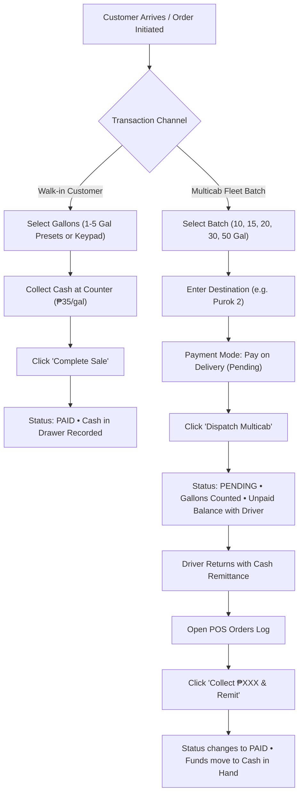
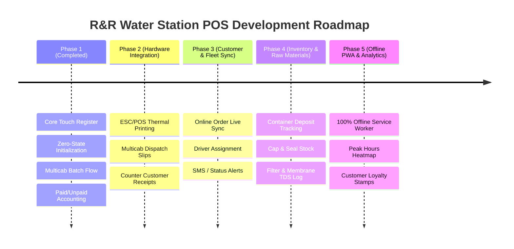

# R&R Water Refilling Station — System Operational Guide & Future Roadmap

This document outlines the complete **User Guide** for operating the R&R Water Refilling Station Point-of-Sale (POS) system, alongside the **Strategic Master Plan** for upcoming hardware, inventory, and online fleet integrations.

---

## Part 1: Comprehensive Operational Guide

### 1. Station Philosophy & Design Principles
- **Built for Philippine Water Stations**: Matches real-world operations where walk-in customers swap bottles on the spot and multicabs dispatch batches with payments collected upon drop-off.
- **Clean Zero-State Startup**: Starts fresh at **0 Gallons**, **₱0.00 Cash**, and **0 Orders** when opened. No placeholder test records polluting daily totals.
- **Single Hero Product**: Dedicated solely to **5-Gallon Purified Water Carboys** (₱35 refill / ₱250 new container). No confusing menus or alkaline distractions.
- **Dedicated POS Counter Tab**: The primary POS screen contains only dispensing products and the keypad calculator — no tall metric cards forcing the cashier to scroll.
- **Monochrome Vector Icons**: Clean, professional Flaticon-style black icons in Light Mode (white in Dark Mode) with zero emojis.

---

### 2. Core Operational Workflows



#### A. Walk-in Refill (Counter Sale)
1. **Choose Gallon**: Tap **5-Gal Purified Refill** (`₱35.00`).
2. **Select Quantity**:
   - Tap a quick preset: `1 Gal (₱35)`, `2 Gal (₱70)`, `3 Gal (₱105)`, `4 Gal (₱140)`, or `5 Gal (₱175)`.
   - Or use the `[-]` / `[+]` stepper, or type whole gallons on the 4×4 numeric keypad.
3. *(Optional)* Type customer name in the note box (e.g., `Aling Tess`).
4. **Collect Cash & Submit**: Tap **`Complete Sale • ₱XX.00 (Paid)`**.
   - Immediate audio chime rings.
   - Transaction logs as **`✓ PAID`**.
   - Amount adds immediately to **Cash Collected (Drawer)**.
   - Order number automatically randomizes (`#XXXXXX`) for the next customer.

#### B. Multicab Fleet Batch Dispatch (Pay on Delivery)
1. In the order header, tap **`[Multicab]`**.
2. **Select Batch Size**:
   - 1-tap batch presets switch to: `10 Gal (₱350)`, `15 Gal (₱525)`, `20 Gal (₱700)`, `30 Gal (₱1,050)`, or `50 Gal (₱1,750)`.
3. **Set Destination**: Enter destination or drop point (e.g., `Purok 1 - Barangay Hall`).
4. **Payment Mode**: Keep default set to **`⏳ Pay on Delivery (Pending)`**.
5. **Dispatch Multicab**: Tap **`Dispatch Multicab • ₱XXX.00 (Pending Payment)`**.
   - Gallons are counted immediately toward daily station output.
   - Cash is held in **Pending Receivables** (with the driver).
   - Drawer cash remains untouched until physical remittance.

#### C. Driver Return & Payment Remittance
1. When the multicab driver returns to the station with collected cash, click **`POS Orders Log`** in the top tab bar (or tap `Orders Log` on the bottom right).
2. Locate the delivery order card with the amber **`⏳ Pending Payment`** tag.
3. Tap the green **`[✓ Collect ₱XXX.XX & Remit]`** button.
   - Success chime plays and toast confirms collection.
   - The order status switches to **`✓ PAID`**.
   - The unpaid amount moves seamlessly from **Pending Receivables** into **Cash Collected (Drawer)**.

#### D. New Container Purchase (With Water)
1. If a customer buys an extra container, tap **New Jug + Water (₱250)**.
2. Adjust quantity and complete sale. Station inventory reflects new container stock.

---

### 3. Navigation & Screen Breakdown

| Screen / View | Where to Access | Purpose |
| :--- | :--- | :--- |
| **POS Machine** | Sidebar `POS` or Top Tab `POS Machine` | High-speed dispensing register. Zero clutter, direct touch presets, keypad, and 1-tap checkout. |
| **POS Orders Log** | Sidebar `Orders` or Top Tab `POS Orders Log` | Real-time digital transaction log. Houses the 4 station metric cards, Paid/Unpaid badges, 1-click driver remittance, CSV export, and Shift Reset. |
| **Fleet Delivery** | Sidebar `Delivered` or Top Tab `Fleet Delivery` | Multicab dispatch dashboard tracking dispatched volume, pending drops, and delivery routes. |
| **Reports / Dashboard** | Sidebar `Reports` or `Dashboard` | Daily station performance breakdown, filtration status, and shift analytics. |

---

### 4. End-of-Day / Shift Closing Procedure
1. Open the **POS Orders Log** tab.
2. Review the 4 Station Metric Cards:
   - **Gallons Dispensed**: Total water volume pumped today.
   - **Cash Collected (Drawer)**: Cash physically counted in the register.
   - **Pending Receivables**: Verify all drivers have remitted (should be `₱0.00` before closing).
   - **Multicab Deliveries**: Confirmed drop count.
3. Tap **`Export CSV`** to download a spreadsheet record (`rr_water_shift_report_*.csv`) with exact Paid, Unpaid, and Gallon breakdowns for station accounting.
4. *(Optional)* Tap **`Print Shift`** to print the daily summary.
5. Tap **`Start New Day / Shift`**:
   - Droppy confirms the action via a modal dialog.
   - Counters reset to clean **0 Gallons** and **₱0.00 Cash** ready for tomorrow's opening.

---

### 5. Utility Controls & Keyboard Shortcuts

- **Theme Toggle (Sun / Moon icon)**: Switches between high-clarity Soft Slate Light Mode and deep Charcoal Dark Mode.
- **Sound Toggle (Speaker icon)**: Toggles audio synthesizer feedback on/off.
- **Clear Order (Trash icon or Clear button)**: Resets current inputs to 1 Gallon and generates a fresh random order number.
- **Global Search**: Type in the subheader search box to instantly filter orders by `#OrderNo`, destination, customer name, or gallon count.

---

## Part 2: Strategic Master Plan for the System



---

### Phase 1: Core Touch Register & Flow Simplification (Completed)
- [x] Streamlined single hero product: 5-Gallon Purified Water Carboys (₱35 refill / ₱250 new container).
- [x] Clean zero-state initialization on fresh open.
- [x] Batch multicab dispatching (10, 15, 20, 30, 50 gallons) with default pending payment.
- [x] Explicit Paid (`₱XX.XX`) vs. Unpaid (`₱YY.YY`) accounting breakdown across all screens.
- [x] 1-click driver remittance settlement (`[✓ Collect ₱XXX & Remit]`).
- [x] Removed tall metric cards from POS tab for zero-scroll ergonomics.
- [x] Monochrome vector icons with zero emojis.

---

### Phase 2: Hardware & Thermal Receipt Printing
*Objective: Connect the POS to physical countertop 58mm / 80mm thermal receipt printers via WebUSB, Web Bluetooth, or standard browser print dialog.*

1. **Multicab Dispatch Slip (Trip Ticket)**:
   - Formatted for 58mm/80mm thermal paper.
   - Printed upon tapping `Dispatch Multicab`:
     ```
     ================================
           R&R WATER REFILLING
          MULTICAB DISPATCH SLIP
     ================================
     Order No:  #839102
     Date/Time: Sep 21, 2026 - 10:15 AM
     Route:     Purok 2 - Aling Nena
     --------------------------------
     Qty:       15 x 5-Gal Purified
     Total:     ₱ 525.00
     Payment:   [PENDING ON DELIVERY]
     TO COLLECT: ₱ 525.00
     --------------------------------
     Driver Signature: ______________
     ================================
     ```
2. **Customer Walk-in Receipt**:
   - Simple, compact payment receipt for walk-ins who request an official station stub.
3. **Hardware Cash Drawer Kick**:
   - Send standard ESC/POS pulse command (`ESC p 0 25 250`) to pop open the physical cash drawer upon completing a cash sale.

---

### Phase 3: Online Order & Fleet Live Sync
*Objective: Unify customer orders placed through `index.html` directly with the countertop POS queue.*

1. **Live Order Ingestion**:
   - When a resident in Purok 1, 2, or 3 orders via the customer web app, an alert notification and sound chime appear in the POS header.
   - Automatically queues under `Multicab Deliveries` with customer address and phone number pre-filled.
2. **Driver Assignment**:
   - Dropdown on multicab dispatch to assign a specific driver (e.g. `Driver Jun - Multicab #1`).
   - Enables auditing which driver has unremitted cash at the end of the shift.
3. **Automated SMS / In-App Notification**:
   - When cashier clicks `Dispatch Multicab`, customer receives a notification: *"Your water has been dispatched via Multicab!"*.

---

### Phase 4: Station Inventory & Consumables Tracking
*Objective: Digital ledger for empties, bottle caps, shrink wraps, and water filtration health.*

1. **Container Deposit & Empties Ledger**:
   - Track borrowed carboys vs. swapped carboys.
   - Alerts when a customer owes empty containers.
2. **Raw Consumables Deduction**:
   - Every gallon dispensed automatically deducts:
     - 1 Cap Seal
     - 1 Shrink Band
   - Low-stock warning when cap supplies drop below 100 units.
3. **Water Quality & Filter Maintenance Log**:
   - Built-in logging for daily Total Dissolved Solids (TDS) readings (e.g. Raw Water: 180 ppm $\rightarrow$ Product Water: 2 ppm).
   - Maintenance timer for replacing 5-micron sediment filters, granular activated carbon, and RO membrane cleaning.

---

### Phase 5: Offline-First PWA & Station Growth Analytics
*Objective: Guarantee 100% station uptime during internet outages and provide visual sales insights.*

1. **Offline Service Worker (PWA)**:
   - Installable on Android tablets, iPads, Windows touchscreens, and POS terminals as a native standalone app.
   - IndexedDB local storage ensures transactions never stop even during power or internet interruptions, syncing automatically when reconnected.
2. **Purok Heatmap & Sales Analytics**:
   - Chart identifying which days and hours experience the highest refill volume.
   - Geographic distribution showing which Purok orders the most multicab water.
3. **Digital Loyalty Card ("10th Refill Free")**:
   - Optional customer phone-number lookup that awards a digital stamp per gallon, automatically applying a free refill after 10 stamps.
